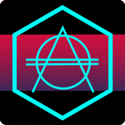

# Upside Don

###### snap je

## Introduction
Upside Don is an addition for the world of Don Diablo (Hexagonia).

The making of this project is powered by our finals of our game development study at MediacollegeAmsterdam. This game is made in colaboration with Bliksems! Dondersgoeie marketing.

## Gameplay summary
---
The  goal of Upside Don is to immerse you in the world of Don Diablo. We do this, by using his style and his songs and implementing his character: Hex. 

The goal of Upside Don is to get as high of a score as you can get. The difficulty of the game changes depending on how well you are playing.

In the game you are driving a car and can ride lanes. The game is rendered in pseudo 3d and has a maximum of 6 lanes to ride uppon. Don Diablo music will be played and pickups will be spawned on the rythem of the music occros one of the 6 lanes. The goal is to pickup the as much pickups as possible by clicking on the lanes you want to travel to and colliding with them. When you miss one, one of your lives will be taken away. Giving an extra tap when you collide with a pickup will give you extra score and will give you a live back.

There is a bar on the left of the game which will slowly fill over time. When filled, you will be rewarded with a hex part. This collection can be viewed in the hex menu, where you can click on 

## Interesting classes
---

## Credits
---
https://github.com/nathannieuwenhuizen/webpack-boilerplate/blob/master/README.md
